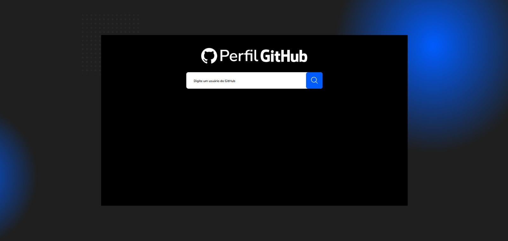
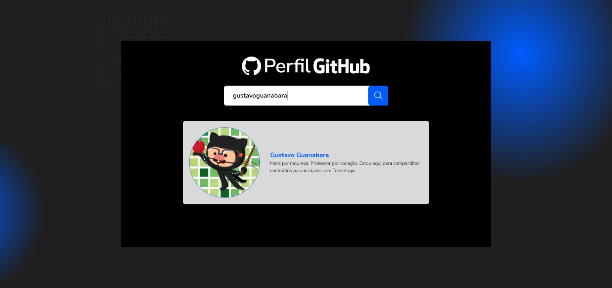
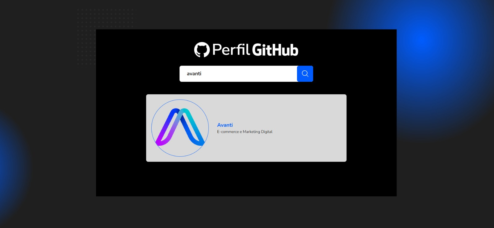
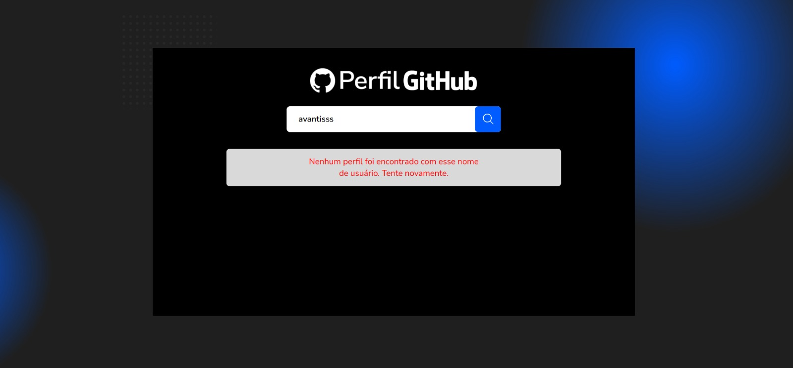
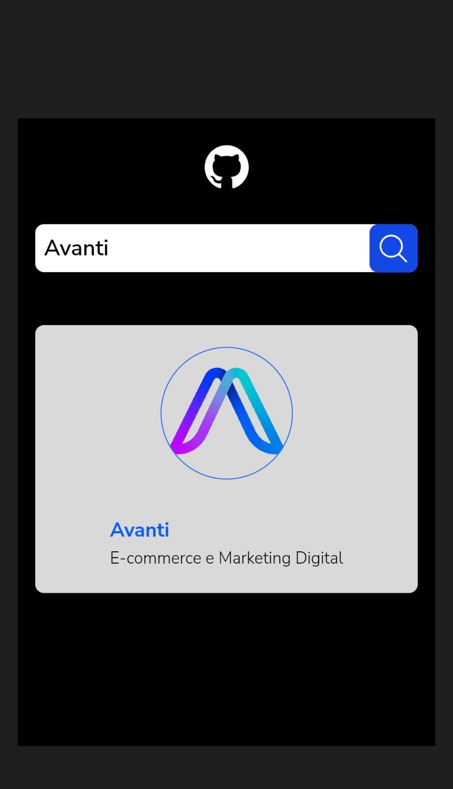

# 🔍 GitHub Profile Search


Aplicação desenvolvida como parte de um **teste técnico**, com o objetivo de buscar e exibir informações de usuários do GitHub. O projeto foi desenvolvido com **React** e **Tailwind CSS**, respeitando o layout proposto no [Figma](https://www.figma.com/proto/DqtFxC6312M32mLt8FpJjq/inovation-class?page-id=22%3A2864&node-id=22-4293&viewport=359%2C115%2C0.25&t=SHsEqEgaMrXGMKwv-1&scaling=scale-down-width&content-scaling=fixed&starting-point-node-id=22%3A4293).

---


## 🧪 Requisitos:


✅ Criar um campo de busca, onde o usuário digita o nome de um perfil do GitHub 
✅ Ao clicar no botão de busca, consumir a [API pública do GitHub](https://api.github.com/) e exibir as seguintes informações do perfil:

- Nome do usuário
- Foto de perfil
- Bio

✅ Exibir mensagens de erro caso o perfil não seja encontrado  
✅ Layout responsivo baseado no Figma  
✅ (Opcional) Implementação de loading visual durante a requisição


---


## 🚀 Tecnologias:

- [React](https://pt-br.react.dev/blog/2023/03/16/introducing-react-dev)
- [Tailwind CSS](https://tailwindcss.com/)
- [Vite](https://vite.dev/)
- [GitHub REST API](https://docs.github.com/pt/rest/quickstart?apiVersion=2022-11-28)
- [Vercel](https://vercel.com/home)


---


## 🛠️ Funcionalidades

- Buscar perfis no GitHub
- Exibir nome, bio, avatar.
- Feedback visual de loading durante a busca
- Tratamento de erros (usuário não encontrado ou campo vazio)
- Design responsivo


---


## 📌 Projeto 


Veja o projeto rodando [aqui](https://teste-avanti-github-search.vercel.app/).


---


## 📸 Screenshots

Algumas capturas de tela para ilustrar diferentes estados do aplicativo:

**Página inicial:**



**Busca de usuários**






**Mensagem de erro ao buscar usuário inexistente**



**Mensagem de campo vazio**


**Versão mobile**




---


## 🛠️ Aprendizados

Trabalhar neste projeto permitiu consolidar o uso de useState e fetch para manipulação de estado e requisições, implementar feedback de carregamento e tratamento de erros. Ao adotar estilos responsivos com Tailwind CSS e layout flexível me fez compreender a importância de uma experiência de usuário fluida mesmo em aplicações simples.

Desafio principal: garantir fidelidade ao design do Figma em diferentes resoluções.


---


## 💻 Como rodar o projeto localmente


⚠️ **Observação**: 

O projeto estará disponível em http://localhost:5173 ou na porta configurada pelo ***Vite***.

É necessário ter o ***Vite*** instalado. Se não tiver, execute:


```bash
npm install -g vite
```


Após ter certeza de que possui o ***Vite*** em sua máquina, rode os comandos:


```bash
# Clone o repositório
git clone https://github.com/seu-usuario/github-profile-search.git

# Acesse a pasta do projeto
cd github-profile-search

# Instale as dependências
npm install

# Inicie o servidor de desenvolvimento
npm run dev
```


---


## 📞 Contato

Construído por Gilberto Xavier.

[LinkedIn](https://www.linkedin.com/in/gilbertosx/)

Email: (gilbertosxavier@live.com)
